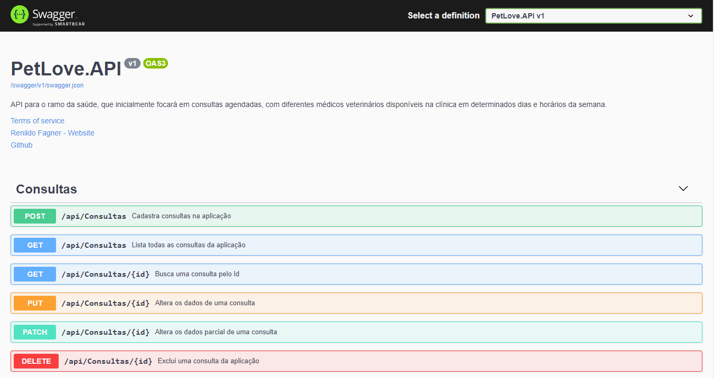
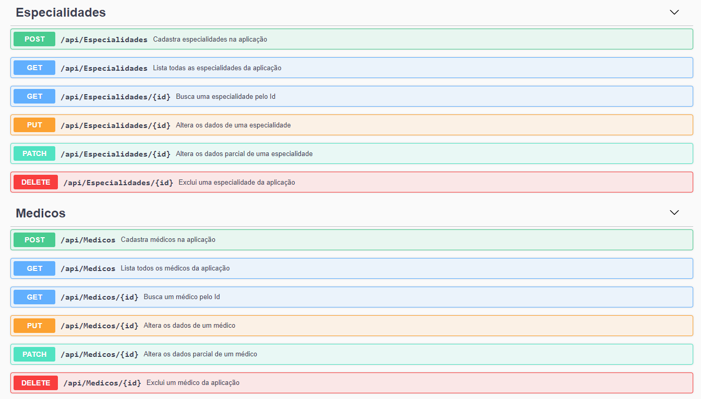
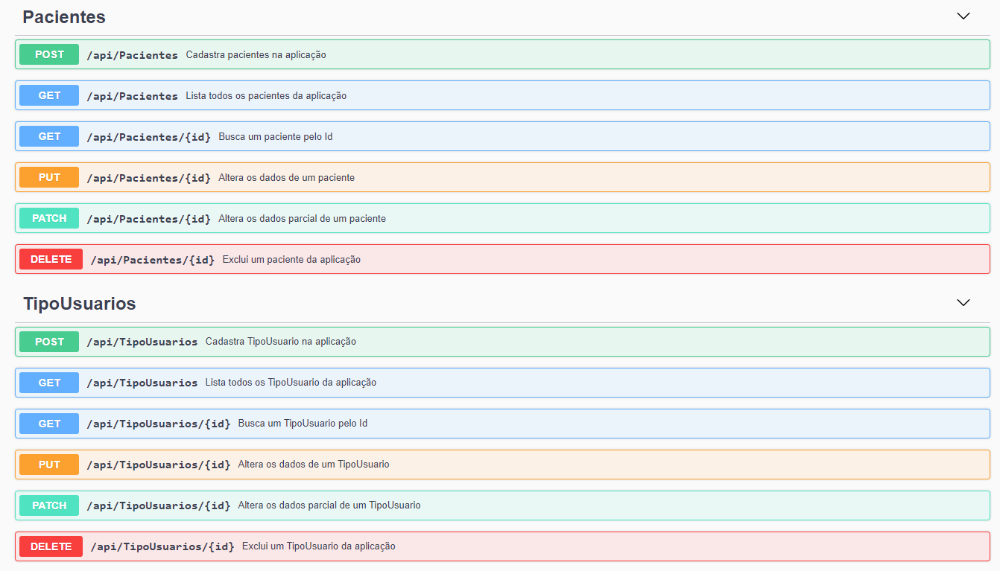
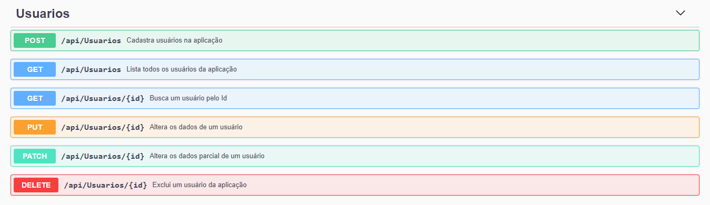
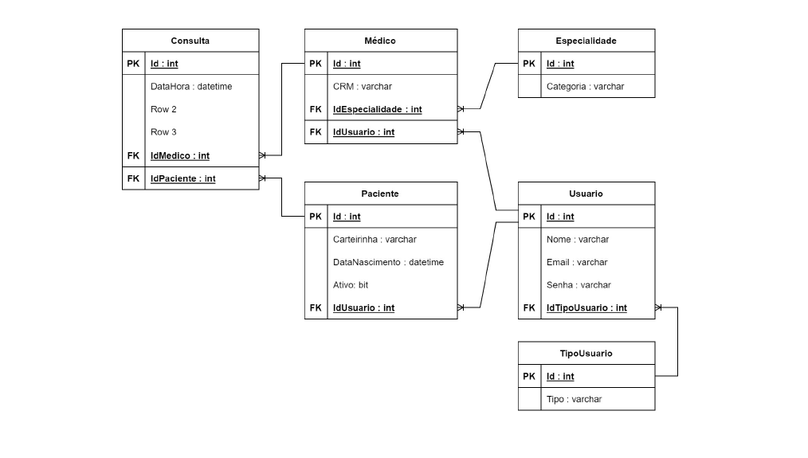

# <p align="center">PetLove.API</p>
<h3 align="center">REST API em ASP.NET Core com: Repository Pattern, Entity Framework Core e SQL Server</h3><br>

<p align="center">
    <br>
    <br>
    <br>
    <br>
</p> <br>

[](https://github.com/rfagner/PetLove/blob/main/LICENSE)<br>


<br>
# <p align="center">Desafio - Case</p>
Situação Problema: Você recebeu uma demanda de criação de uma API para o ramo
da saúde, que inicialmente focará em consultas agendadas, com diferentes médicos
veterinários disponíveis na clínica em determinados dias e horários da semana.<br><br>

Com base no diagrama abaixo, utilize o Entity Framework Core escolhendo entre as
abordagens:<br>

- Code First
- Database First<br>

# <p align="center">Diagrama Lógico</p>

<p align="center">
    <br>    
</p>

# Sobre o projeto
REST API em ASP.NET Core com: Repository Pattern, Entity Framework Core e SQL Server e tem como principal objetivo gerenciar uma clínica veterinária e controlar os dados e relações de pacientes e médicos.<br><br>
A aplicação consiste em:<br><br>
- Cadastrar um novo paciente<br><br>
- Cadastrar um novo médico<br><br>
- Ler a lista de pacientes cadastrados<br><br>
- Ler a lista de médicos cadastrados<br><br>
- Marcar consultas com veterinários<br><br>


# Tecnologias usadas
- C#<br><br>
- .NET 5<br><br>
- ASP.NET Core<br><br>
- Entity Framework Core<br><br>
- Repository Pattern<br><br>
- Singleton<br><br>
- Postman<br><br>
- SQL Server<br><br>
- Swagger<br><br>
- Biblioteca para Criptografia BCrypt<br><br>
- JWT Jason Web Token

# Como executar o projeto

Pré-requisitos: .NET 5

```bash
# clonar repositório
git clone https://github.com/rfagner/PetLove

# entrar na pasta do projeto PetLove
cd PetLove.API

# executar o projeto
dotnet run

``` 
<br><br>
# Autor

Renildo Fagner dos Santos de Assis

https://www.linkedin.com/in/rfagner/
